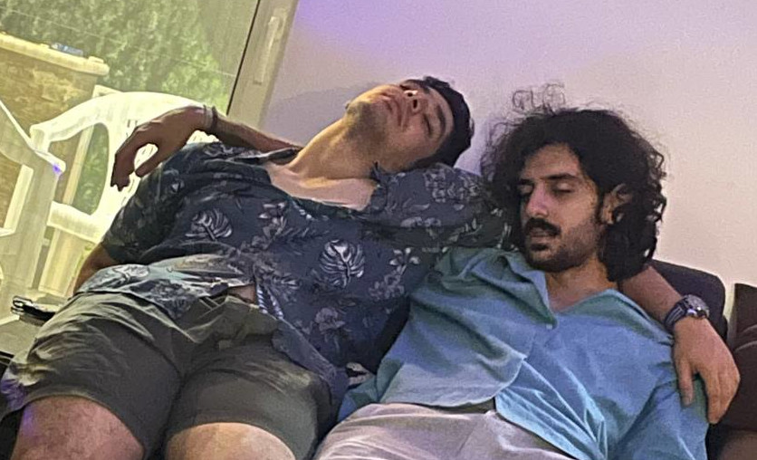

Last night, I was in the airport. The first and the best friend I made in the university was leaving Iran. He was going to continue his studies in Canada. I was there to say goodbye to him. I was there to say goodbye to a friend who was always there for me. I was shocked last night, but now I am devastated like I have never been before. 

> Round like a circle in a spiral, like a wheel within a wheel  
Never ending or beginning on an ever-spinning reel  
Like a snowball down a mountain or a carnival balloon  
Like a carousel that's turning, running rings around the moon  
Like a clock whose hands are sweeping past the minutes of its face  
And the world is like an apple whirling silently in space  
Like the circles that you find  
In the windmills of your mind

Kahbod sent me [**"The Windmills of Your Mind"** song performed by **Farhad**](../assets/2023-08-11-kahbod/10_Windmills_of_Your_Mind.mp3) excactly 1356 days ago. Now I am listening to it again and I couldn't relate to it more. I am thinking about all the memories we had. I learned a lot from the way he is. I don't know when I will see him again. I just wish him the best wherever he is.

