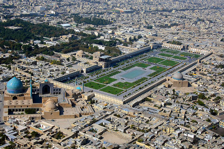
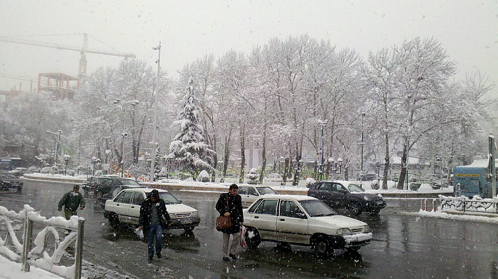

تو انگلیسی دو تا کلمه کاملا واضح داریم:

1. Square: an open, typically four-sided, area surrounded by buildings in a village, town, or city.
2. Roundabout: a road junction at which traffic moves in one direction round a central island to reach one of the roads converging on it.

خب معنی مشخصه. 
Square
میشه جایی مثل میدان نقش جهان اصفهان. 

معنی 
Roundabout
هم مشخصه. میشه جایی مثل میدان تجریش.

Hold on a second. WTF bro?

چرا جفتشون میدان شدن؟ رفتم ویکی‌پدیا انگلیسی جفتشونو پیدا کردم بعد زبانو به فارسی تغییر دادم 
(همیشه واسه این که معادل یه کلمه تخصصیو بفهمم این کارو میکنم). 
به این نتیجه رسیدم که 
Square
میشه میدان و 
Roundabout
میشه فلکه. 

خب منطقی‌تر شد. ولی جدی چرا عین آدم کلمه‌ها رو استفاده نمی‌کنن؟ 😂

یه خارجی بیاد ایران ببینه به یه چیز گرد میگن 
Square
پشماش میریزه. 😂

